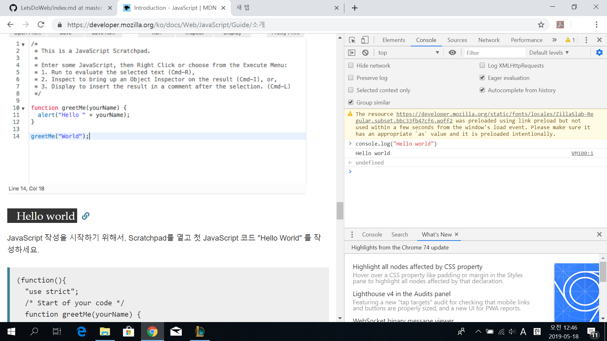

# Javascript  
## What is JavaScript?
[JS란 무엇인가, JS 튜토리얼](https://developer.mozilla.org/ko/docs/Web/JavaScript/Guide/%EC%86%8C%EA%B0%9C)

## Lets learn JS!
- [JS의 문법과 자료형, JS 튜토리얼](https://developer.mozilla.org/ko/docs/Web/JavaScript/Guide/Values,_variables,_and_literals#Anchor_1)

## 참고
f12 를 누르면 javascript를 쓸 수 있습니다!! 
이미지 참고

   
      
      
아니면 온라인으로 제공되는 codepen 을 이용해 봅시다!
- [codepen](https://codepen.io/pen/?editors=0010)
