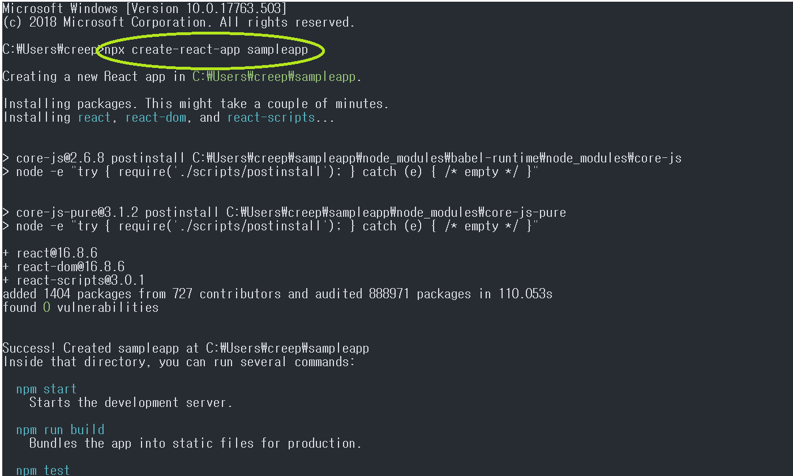
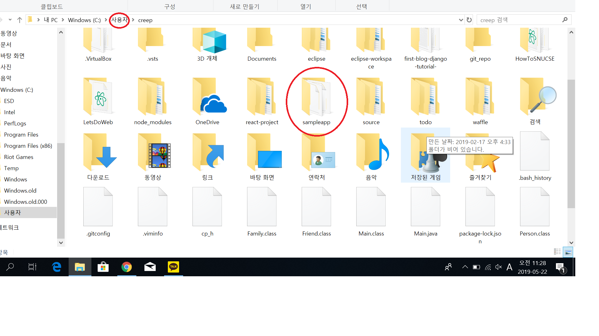

# React  

## What is React?   
[리액트란?](http://blog.naver.com/PostView.nhn?blogId=jdub7138&logNo=221071408817&parentCategoryNo=&categoryNo=109&viewDate=&isShowPopularPosts=true&from=search)

## Settings

1. download react [here](https://arc.js.org/)    
2. click React -> Take the tutorial   
3. click setup for tutorial!! They'll explain everything   

   for Node.js download [click](https://nodejs.org/ko/download/)   
      
        
           
              
                 
                 
follow the tutorial on cmd   
if successful   

   
    
new directory generated!    
    
    

